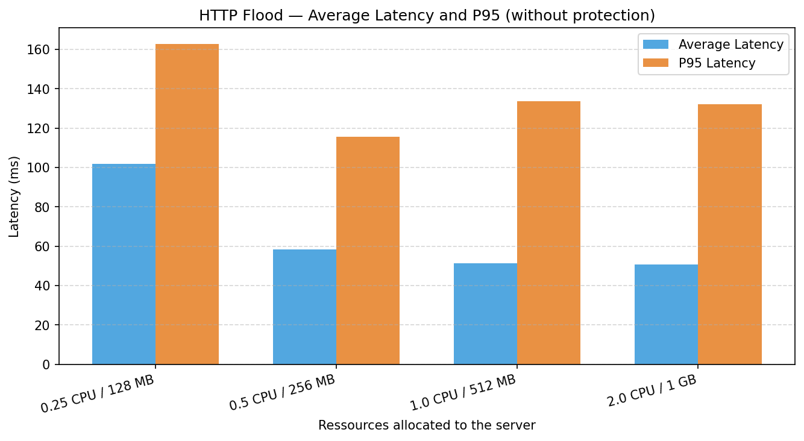
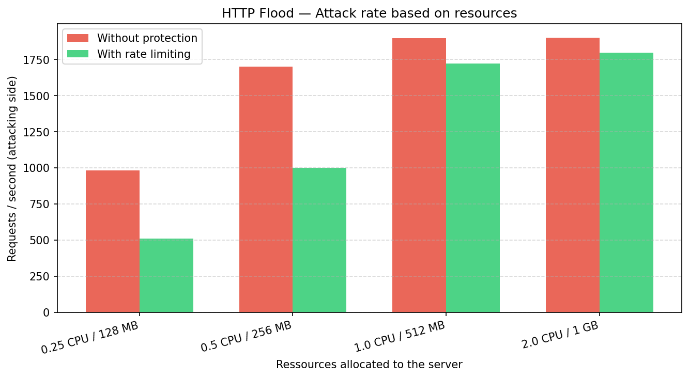
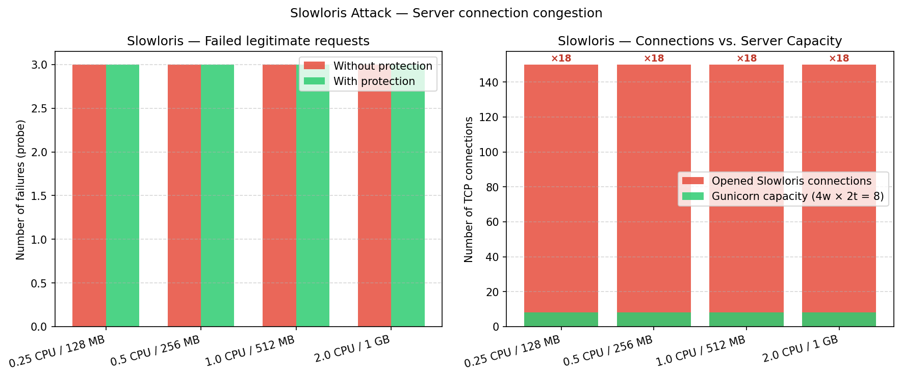
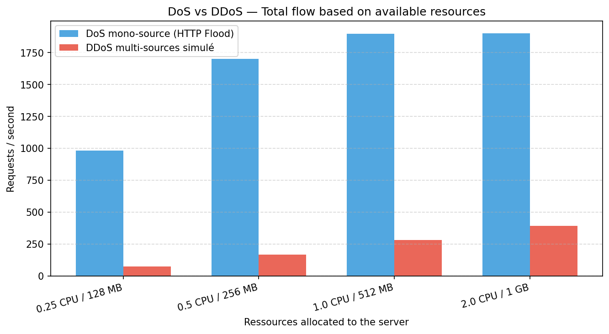
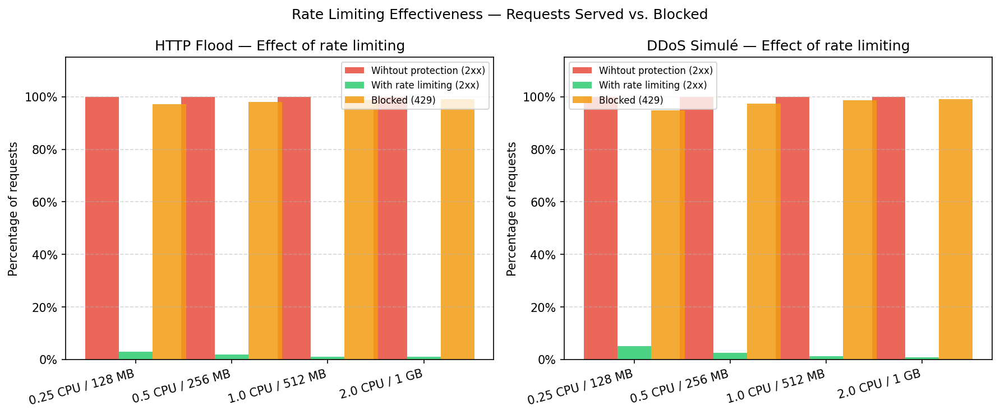

# Simulation et analyse d'attaques par déni de service (DoS/DDoS)

## Introduction

Les attaques par déni de service constituent l'une des menaces les plus anciennes et les plus répandues en sécurité informatique. Contrairement aux attaques visant la confidentialité ou l'intégrité des données, elles s'en prennent à la disponibilité d'un service, rendant celui-ci inaccessible à ses utilisateurs légitimes. Ce rapport présente la conception et l'analyse d'un laboratoire de simulation d'attaques DoS et DDoS réalisé dans un environnement contrôlé.

L'objectif est double : d'une part comprendre les mécanismes sous-jacents à ces attaques, d'autre part mesurer quantitativement l'impact des ressources matérielles allouées au serveur cible sur sa résistance. Une comparaison avec et sans mécanisme de défense (rate limiting) complète l'analyse.

La section 1 pose le contexte théorique. Les sections 2 et 3 précisent les objectifs. La section 4 présente la structure du projet. Les sections 5 et 6 présentent et interprètent les résultats. La section 7 discute des pistes d'amélioration.

---

## 1. Contexte général de la problématique

### 1.1 Définition et classification des attaques DoS/DDoS

Une attaque par déni de service (DoS, *Denial of Service*) consiste à envoyer un volume de requêtes ou de connexions suffisant pour épuiser les ressources d'un serveur cible (CPU, mémoire, connexions réseau), le rendant incapable de traiter les demandes légitimes [1]. Lorsque l'attaque provient de multiples sources coordonnées, on parle d'attaque distribuée (DDoS, *Distributed Denial of Service*), ce qui complique considérablement la défense basée sur le blocage par adresse IP.

Du point de vue de la pile réseau, les attaques se classent en trois catégories principales [2] :

| Couche | Type | Exemple |
|--------|------|---------|
| Couche 3/4 (réseau/transport) | Volumétrique ou protocolaire | SYN Flood, UDP Flood, ICMP Flood |
| Couche 7 (applicative) | Épuisement applicatif | HTTP Flood, Slowloris |
| Amplification | Réflexion | DNS Amplification, NTP Amplification |

Ce projet se concentre sur les attaques de couche 7 (HTTP), les plus pertinentes avec un serveur web Flask, et sur la simulation d'un DDoS multi-sources.

### 1.2 Mécanismes des attaques implémentées

**HTTP Flood** : L'attaquant ouvre un grand nombre de connexions TCP simultanées et envoie des requêtes HTTP GET complètes à un rythme maximal. Chaque requête est légale ; c'est le volume qui sature le serveur. Le serveur doit traiter chaque requête (parser les en-têtes, exécuter la logique applicative, formater la réponse), consommant du CPU et de la mémoire pour chacune.

**Slowloris** : Proposée par RSnake en 2009 [3], cette technique maintient un grand nombre de connexions TCP partiellement ouvertes en envoyant des en-têtes HTTP incomplets très lentement. Le serveur garde chaque connexion ouverte dans l'attente de la fin de la requête, épuisant son pool de workers ou de threads disponibles. Les requêtes légitimes ne trouvent plus de worker disponible pour les traiter.

**DDoS simulé (multi-sources)** : Plusieurs processus indépendants, chacun avec son propre pool de threads et un *User-Agent* distinct, lancent simultanément un HTTP Flood. Cela simule des attaques provenant de différentes origines, rendant le blocage par adresse IP source inefficace:  chaque source individuelle semble modérée.

### 1.3 Exemples réels et impacts

Les attaques DDoS sont en augmentation constante. En 2018, GitHub a subi l'une des plus grandes attaques jamais enregistrées : 1,3 Tbps via une amplification Memcached [4]. En 2020, AWS a rapporté une attaque à 2,3 Tbps [5]. Ces chiffres illustrent que même des infrastructures de très grande taille sont vulnérables. Pour une petite organisation ou un service critique (hôpital, infrastructure nationale), une attaque volumétrique modeste peut suffire à provoquer une interruption de service totale, avec des conséquences financières ou humaines graves.

---

## 2. Objectifs conceptuels

1. Comprendre les mécanismes de trois types d'attaques DoS/DDoS de couche 7 (HTTP Flood, Slowloris, DDoS multi-sources) et leurs différences fondamentales.

2. Relier ressources matérielles et résistance aux attaques : établir quantitativement comment la limitation en CPU et en RAM d'un serveur affecte sa capacité à absorber un volume d'attaque donné.

3. Comprendre le fonctionnement d'un serveur web multi-processus/multi-threadé (gunicorn) et en quoi l'architecture du serveur détermine sa vulnérabilité à chaque type d'attaque.

4. Évaluer l'efficacité d'une contre-mesure applicative (rate limiting) et comprendre ses limites face à des attaques distribuées.

---

## 3. Objectifs pratiques

1. Mettre en place un serveur cible reproductible : une application Flask déployée dans un conteneur Docker, dont les ressources (CPU, mémoire) sont contrôlées par les paramètres Docker (`--cpus`, `--memory`).

2. Implémenter trois scripts d'attaque en Python :
   - `http_flood.py` : flood HTTP multi-threadé avec collecte de métriques (latence, req/s, taux d'erreur).
   - `slowloris.py` : maintien de connexions partielles avec mesure de l'impact sur les clients légitimes.
   - `ddos_sim.py` : simulation multi-processus d'un DDoS depuis N sources distinctes.

3. Automatiser les benchmarks : un script `benchmark.py` organise la séquence complète, c'est à dire la construction de l'image Docker, le démarrage du conteneur avec une configuration donnée, l'exécution des attaques, arrêt du conteneur, et lasauvegarde des résultats. Cela pour quatre configurations de ressources et deux modes (avec/sans protection).

4. Visualiser les résultats : générer automatiquement des graphiques comparatifs (latence, taux de succès, taux de blocage, saturation des connexions) via `visualize.py`.

---

## 4. Architecture du projet

Le projet est organisé autour d'une architecture modulaire permettant d'automatiser l'ensemble du processus expérimental, depuis le déploiement du serveur jusqu'à la génération des graphiques.

### 4.1 Serveur cible

Le serveur est une application Flask exécutée avec Gunicorn dans un conteneur Docker. Les ressources allouées au conteneur (CPU et mémoire) sont configurables afin d'évaluer leur influence sur la résistance aux attaques. Une variante du serveur intègre Flask-Limiter afin de comparer le comportement avec et sans mécanisme de protection.

### 4.2 Scripts d'attaque

Trois outils d'attaque indépendants ont été développés en Python :

- **HTTP Flood** : envoi massif de requêtes HTTP GET concurrentes à l'aide de plusieurs threads.
- **Slowloris** : maintien d'un grand nombre de connexions HTTP incomplètes afin d'occuper les ressources du serveur.
- **DDoS simulé** : lancement de plusieurs processus indépendants, chacun exécutant un HTTP Flood, afin de simuler une attaque distribuée.

Chaque script collecte différentes métriques, notamment le nombre de requêtes envoyées, le débit, la latence moyenne, les percentiles de latence et le taux d'erreur.

### 4.3 Orchestration des benchmarks

Le script `benchmark.py` automatise l'ensemble des expériences. Pour chaque configuration de ressources, il :

1. construit l'image Docker,
2. démarre le serveur avec la configuration souhaitée,
3. exécute les différents scénarios d'attaque,
4. enregistre les métriques produites,
5. arrête le conteneur avant de passer à la configuration suivante.

Cette approche garantit la reproductibilité des mesures et limite les interventions manuelles.

### 4.4 Visualisation des résultats

Les données collectées sont ensuite traitées par `visualize.py`, qui génère les graphiques utilisés dans ce rapport. Les visualisations permettent de comparer les différentes configurations matérielles ainsi que l'effet des mécanismes de défense sur les performances du serveur.

### 4.5 Organisation du dépôt

```text
.
├── benchmark.py          # Orchestration des expériences
├── visualize.py          # Génération des graphiques
├── attacks/
│   ├── http_flood.py
│   ├── slowloris.py
│   └── ddos_sim.py
├── server/
│   ├── app.py
│   ├── app_protected.py
│   └── Dockerfile
├── results/
│   └── graphs/
└── report.pdf
```

---

## 5. Résultats obtenus

### 5.1 Environnement de test

| Composant | Valeur |
|-----------|--------|
| Serveur cible | Flask 3.1 + Gunicorn 23.0 (4 workers, 2 threads/worker) |
| Conteneurisation | Docker, image `python:3.11-slim` |
| Configurations testées | 0.25 CPU / 128 MB — 0.5 CPU / 256 MB — 1.0 CPU / 512 MB — 2.0 CPU / 1 GB |
| Durée par test | 20 secondes |
| Mitigation testée | Flask-Limiter : 200 req/min et 30 req/s par IP |
| Langage attaquant | Python 3.11 |
| Réseau | Réseau local (port 5001) |

Chaque configuration a été testée successivement avec les trois types d'attaques, d'abord sur le serveur non protégé, puis sur le serveur avec rate limiting.

### 5.2 HTTP Flood

Le flood HTTP envoie des requêtes GET concurrentes depuis 100 threads vers l'endpoint `/`.

**Tableau 5.1 — HTTP Flood sans protection**

| Configuration | Req totales | Req/s | Latence moyenne | Latence P95 |
|--------------|-------------|-------|-----------------|-------------|
| 0.25 CPU / 128 MB | 19 711 | 982 | 101.89 ms | 162.8 ms |
| 0.5 CPU / 256 MB | 34 534 | 1 700 | 58.44 ms | 115.6 ms |
| 1.0 CPU / 512 MB | 41 523 | 1 899 | 51.36 ms | 133.5 ms |
| 2.0 CPU / 1 GB | 42 149 | 1 902 | 50.83 ms | 132.1 ms |

Le taux de succès (HTTP 2xx) reste à 100 % dans tous les cas car le serveur répond à toutes les requêtes, mais avec une latence significativement plus élevée sous contrainte de ressources. On observe un plateau entre 1.0 et 2.0 CPU (1899 vs 1902 req/s), indiquant que le goulot d'étranglement a changé de nature (voir section 6).





### 5.3 Slowloris

L'attaque ouvre 150 connexions TCP partielles simultanément. Le serveur gunicorn dispose de 4 workers × 2 threads = 8 threads actifs.

**Tableau 5.2 — Slowloris**

| Configuration | Sockets ouverts | Ratio sockets/workers | Échecs probe |
|--------------|-----------------|----------------------|--------------|
| 0.25 CPU / 128 MB | 150 | ×18.75 | 3 |
| 0.5 CPU / 256 MB | 150 | ×18.75 | 3 |
| 1.0 CPU / 512 MB | 150 | ×18.75 | 3 |
| 2.0 CPU / 1 GB | 150 | ×18.75 | 3 |

Les 150 connexions Slowloris représentent 18,75 fois la capacité de traitement simultané du serveur. L'impact observable est uniforme quelle que soit la configuration CPU/RAM, ce qui illustre que Slowloris exploite une vulnérabilité architecturale (le nombre de workers) et non une limitation en ressources computationnelles.



### 5.4 DDoS simulé multi-sources

L'attaque est lancée depuis 8 processus indépendants, chacun avec 15 threads, soit 120 "clients" simultanés au total.

**Tableau 5.3 — DDoS multi-sources sans protection**

| Configuration | Req totales | Req/s | Latence moyenne | Latence P95 |
|--------------|-------------|-------|-----------------|-------------|
| 0.25 CPU / 128 MB | 10 906 | 75 | 165.94 ms | 296.3 ms |
| 0.5 CPU / 256 MB | 28 970 | 165 | 83.04 ms | 183.4 ms |
| 1.0 CPU / 512 MB | 49 408 | 282 | 48.75 ms | 91.5 ms |
| 2.0 CPU / 1 GB | 78 307 | 391 | 30.73 ms | 61.4 ms |

Contrairement au HTTP Flood mono-source, le DDoS continue de bénéficier de l'augmentation des ressources au-delà de 1 CPU, atteignant 391 req/s à 2.0 CPU. La variabilité de la latence P95 est également plus marquée (de 61 ms à 296 ms).



### 5.5 Effet du rate limiting

Le serveur protégé applique une limite de 30 requêtes par seconde par adresse IP source, via Flask-Limiter [6]. Les requêtes excédentaires reçoivent une réponse HTTP 429 (*Too Many Requests*).

**Tableau 5.4 — HTTP Flood avec rate limiting**

| Configuration | Req 2xx | Req 429 (bloquées) | Taux de blocage |
|--------------|---------|-------------------|-----------------|
| 0.25 CPU / 128 MB | 299 | 9 965 | 97.09 % |
| 0.5 CPU / 256 MB | 399 | 19 648 | 98.01 % |
| 1.0 CPU / 512 MB | 399 | 36 743 | 98.93 % |
| 2.0 CPU / 1 GB | 399 | 39 369 | 99.00 % |

Avec une limite de 30 req/s, le serveur ne sert effectivement que ~300–400 requêtes sur la durée du test de 20 secondes, soit environ 20 req/s en moyenne, proche de la limite configurée. Toutes les autres requêtes sont rejetées avec un code 429, sans consommer de ressources applicatives significatives.



---

## 6. Interprétation des résultats

### 6.1 Relation CPU et capacité de traitement (HTTP Flood)

Les résultats du tableau 5.1 montrent une amélioration quasi-linéaire de la latence entre 0.25 CPU (101.89 ms) et 0.5 CPU (58.44 ms), puis 1.0 CPU (51.36 ms), soit une réduction de 43 % de la latence en doublant le CPU de 0.25 à 0.5.

Le plateau observé entre 1.0 et 2.0 CPU (51.36 ms vs 50.83 ms) s'explique par un changement de goulot d'étranglement : au-delà de 1.0 CPU, ce n'est plus le CPU qui limite le débit, mais le nombre de workers gunicorn (4 workers × 2 threads = 8 connexions simultanées). Ajouter du CPU ne change pas le nombre maximal de requêtes traitées en parallèle. Cette observation illustre le principe de la surface d'attaque architecturale : même avec des ressources matérielles abondantes, une contrainte logicielle peut devenir le point de défaillance.

### 6.2 Slowloris et l'architecture multi-threadée

Le tableau 5.2 révèle un résultat surprenant : l'attaque Slowloris produit le même impact (3 échecs de probe) quelle que soit la configuration matérielle. Cela démontre que Slowloris cible une vulnérabilité architecturale, le nombre fini de workers, et non une limitation CPU ou RAM.

Cependant, l'impact observé reste limité : gunicorn utilise par défaut un modèle de workers synchrones avec une gestion des connexions en backlog noyau. Les connexions Slowloris sont maintenues dans la file TCP du noyau (backlog), qui est de 2048 par défaut, et non directement dans les threads applicatifs. Ce comportement différerait avec un serveur Apache en mode prefork, contre lequel Slowloris est historiquement plus efficace [3]. Ce résultat est une contre-mesure implicite : le choix d'un serveur multi-threadé réduit naturellement la vulnérabilité à Slowloris.

### 6.3 Efficacité du rate limiting

Le rate limiting atteint un taux de blocage de 97 à 99 % selon la configuration (voir section 5.5). Cette contre-mesure est très efficace contre un HTTP Flood mono-source car toutes les requêtes proviennent de la même adresse IP. Le serveur ne traite effectivement que ~20 req/s au lieu des ~1000–1800 req/s soumises.

Toutefois, cette contre-mesure a une limite face au DDoS multi-sources simulé en section 5.4. Chaque source dispose de sa propre limite de 30 req/s. Avec 8 sources distinctes, la limite effective devient 8 × 30 = 240 req/s autorisées, ce qui dépasse largement la capacité du serveur à 0.25 CPU. Un attaquant disposant de nombreuses sources peut donc contourner le rate limiting par IP. Des contre-mesures complémentaires (limitation globale, CAPTCHA, CDN, BGP blackholing) seraient nécessaires dans ce cas [7].

### 6.4 Le serveur n'a jamais "planté"

Fait notable : dans aucune configuration, le serveur n'a retourné d'erreur HTTP 5xx. Le taux d'erreur reste à 0 % pour toutes les attaques sans protection. Cela s'explique par deux facteurs : (1) l'attaquant et le serveur s'exécutent sur la même machine physique, limitant la puissance totale de l'attaque ; (2) gunicorn gère proprement les connexions en excès via le backlog TCP sans crasher. Dans un scénario réel avec un attaquant externe et une bande passante illimitée, le résultat serait différent.

---

## 7. Améliorations possibles

**7.1 Attaques complémentaires**

L'attaque SYN Flood (couche 4) n'a pas été implémentée car elle requiert des sockets bruts (*raw sockets*) et des droits *root*, et son efficacité dépend fortement des paramètres réseau. Une implémentation via la bibliothèque `scapy` serait envisageable dans une VM Linux dédiée [8].

Une attaque par amplification DNS illustrerait les attaques volumétriques de couche réseau, mais nécessite une infrastructure réseau plus complexe.

**7.2 Métriques plus précises**

Le mécanisme de probe du Slowloris pourrait être amélioré en augmentant le nombre de sondes simultanées et en les lançant dès le début du test, avant l'ouverture des connexions lentes. Cela permettrait de capturer l'évolution temporelle de la dégradation du service (voir section 5.3).

**7.3 Mitigations supplémentaires**

- **Nginx en reverse proxy** : limite les connexions par IP au niveau du serveur HTTP, avant même que la requête n'atteigne Flask.
- **fail2ban** : détection automatique et bannissement des IPs sur la base des logs d'accès.
- **CDN / WAF** (ex. Cloudflare) : absorption des attaques volumétriques en amont du serveur d'origine.
- **Limitation globale** : une limite sur le nombre total de requêtes par seconde (toutes IPs confondues) serait plus efficace contre un DDoS multi-sources.

**7.4 Scénarios plus réalistes**

Tester depuis une machine séparée (réseau local ou VPN) permettrait d'exercer une pression plus réaliste sur le serveur, sans partager les ressources CPU de la machine hôte avec l'attaquant.

---

## Conclusion

Ce projet a permis de simuler et mesurer quantitativement l'impact de trois types d'attaques DoS/DDoS sur un serveur web Flask conteneurisé. Les résultats montrent que les ressources matérielles (CPU, RAM) influencent significativement la résistance à un HTTP Flood, avec une amélioration de la latence de 43 % lors du passage de 0.25 à 0.5 CPU. Cependant, un plateau apparaît à 1.0 CPU, révélant un goulot d'étranglement architectural (nombre de workers gunicorn).

L'attaque Slowloris illustre qu'une vulnérabilité architecturale peut être indépendante des ressources matérielles, tandis que la simulation DDoS multi-sources démontre la limite des mitigations par IP.

Le rate limiting s'avère une contre-mesure très efficace contre un attaquant mono-source (97–99 % de blocage), mais insuffisant face à un DDoS distribué. Ces résultats confirment qu'il n'existe pas de solution unique : la défense en profondeur, combinant plusieurs mécanismes complémentaires, est indispensable pour protéger la **disponibilité** d'un service contre les attaques par déni de service.

---

## Références

[1] OWASP, *Denial of Service Cheat Sheet*, disponible sur : https://cheatsheetseries.owasp.org/cheatsheets/Denial_of_Service_Cheat_Sheet.html (consulté en juin 2026).

[2] Cloudflare, *What is a DDoS Attack?*, disponible sur : https://www.cloudflare.com/learning/ddos/what-is-a-ddos-attack/ (consulté en juin 2026).

[3] RSnake (R. Hansen), *Slowloris HTTP DoS*, 2009, disponible sur : https://web.archive.org/web/20150315054838/http://ha.ckers.org/slowloris/ (consulté en juin 2026).

[4] GitHub, *February 28 DDoS Incident Report*, 2018, disponible sur : https://github.blog/2018-03-01-ddos-incident-report/ (consulté en juin 2026).

[5] AWS, *AWS Shield Threat Landscape Report Q1 2020*, disponible sur : https://aws-shield-tlr.s3.amazonaws.com/2020-Q1_AWS_Shield_TLR.pdf (consulté en juin 2026).

[6] Flask-Limiter, *Documentation officielle*, disponible sur : https://flask-limiter.readthedocs.io/ (consulté en juin 2026).

[7] CERT.org / CISA, *Understanding Denial-of-Service Attacks*, disponible sur : https://www.cisa.gov/news-events/news/understanding-denial-service-attacks (consulté en juin 2026).

[8] Scapy Project, *Scapy documentation*, disponible sur : https://scapy.readthedocs.io/ (consulté en juin 2026).
